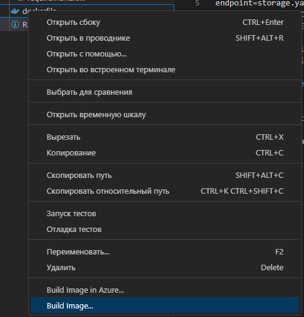
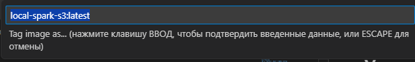
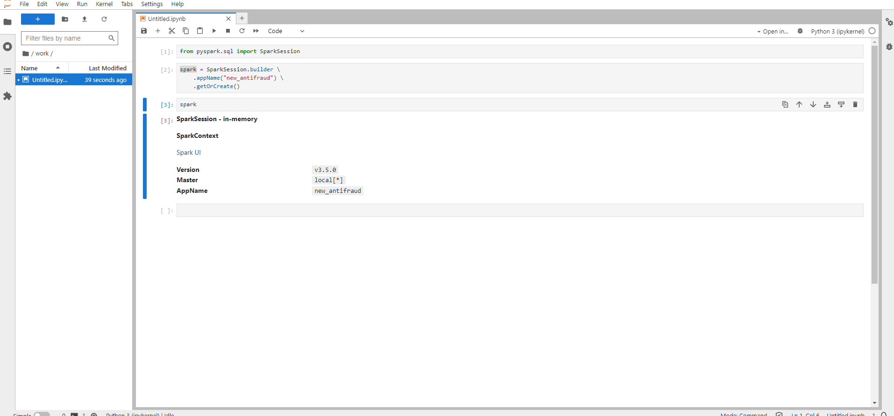
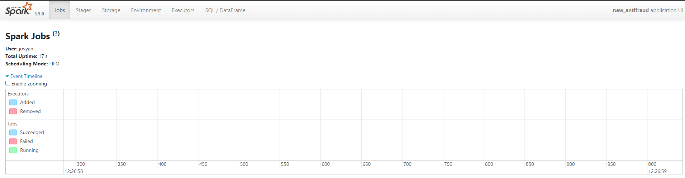

Предварительно установить докер
```
https://www.docker.com/products/docker-desktop/
```
Не обязательно десктопную версию, хватит и консольной, но десктопная удобнее.

# Установка
## 0. Скопируйте в отдельную папку содержимое репозитория, чтобы не выгружать ваши конфиги

## 1. Дополнить файлы в папке config:
1.1 Заполнить connetions своими ключами:
```
endpoint=storage.yandexcloud.net
access_key=<YOUR_ACCESS_KEY>
secret_key=<YOUR_SECRET_KEY>
```
1.2 Дополнить requirements.txt нужными библиотеками (в сам контенейр можно установить через pip)

## 2. Собрать контейнер
2.1.а В терминале 
```
docker build -t local-spark-s3 .
```
2.1.б Из расширения




2.2 Запустить контейнер
```
docker run -p 8888:8888 -p 4040:4040 -d -v <путь_до_папки_на_локальной_машине>:/home/jovyan/work local-spark-s3
```
* -p - порт
* -d - отключение вывода в консоль
* -v - монтирование папки 

Может спросить прав на папку, которую монтируете - **Разрешить**

# Начало работы
## Старт контейнера
```
docker run -p 8888:8888 -p 4040:4040 -d -v <путь_до_папки_на_локальной_машине>:/home/jovyan/work local-spark-s3
```

## Jupiter
```
http://localhost:8888/
```
Установлен JupiterLab - практически ни чем не отличается от нашего, но есть дерево с навигацией


## SparkUI
```
http://localhost:4040/
```
**SparkUI** - привычный Spark Hystory, но позволяет смотреть, что происходит в джобе прямо сейчас, не дожидаясь её завершения
